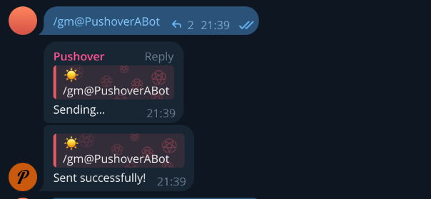

<h1 align="center">Pushover Bot</h1>

<p align="center">
  
</p>

<p align="center">
  <a href="https://t.me/PushoverABot"></a>
  
  
  <a href="LICENSE"></a>
</p>

Telegram bot for emergency notifications via [Pushover](https://pushover.net/). Wakes you up with a siren even when your phone is on silent. Add the bot to a group — any member can send an emergency alert to everyone or a specific person.

> **Note:** Group Privacy Mode must be **disabled** in BotFather. Otherwise the bot won't receive messages in groups (except commands and replies). If it was enabled, remove and re-add the bot to the group.

## Features

- **Emergency alerts** — Pushover Priority 2, bypasses quiet hours, repeats every 30s until acknowledged
- **Group chats** — `/gm` sends a siren to all subscribed members
- **Targeted notifications** — `/gm @username`, `/gm user_id`, or `/gm username`
- **Custom text** — `/gm hello` or `/gm @username wake up`
- **Message archiving** — saves all group messages to DB with media files
- **HTML export** — searchable archive with media thumbnails
- **Broadcast** — mass messaging for admins
- **Rate limiting** and **multi-language** support (EN, RU, UK)

## Quick Start

```bash
git clone https://github.com/DefaultPerson/pushover-bot.git
cd pushover-bot
cp .env.example .env
nano .env  # fill in BOT_TOKEN, PUSHOVER_APP_TOKEN, DB_PASSWORD
docker compose -f docker-compose.full.yml up -d
```

`docker-compose.full.yml` runs PostgreSQL, Redis, and the bot together.

For a fresh VPS, deploy with a single command:

```bash
curl -fsSL https://raw.githubusercontent.com/DefaultPerson/pushover-bot/main/scripts/deploy.sh | bash
```

## Commands

### Private chat

| Command | Description |
|---------|-------------|
| `/key` | Set up Pushover User Key |
| `/list` | Groups with active notifications |
| `/test_alarm` | Send a test siren to yourself |
| `/language` | Change language |

### Group chat

| Command | Description |
|---------|-------------|
| `/gm` | Alert everyone |
| `/gm text` | Alert everyone with custom text |
| `/gm @username` | Alert a specific member |
| `/gm @username text` | Specific member with custom text |
| `/gm user_id` | Alert by user ID |
| `/enable` / `/disable` | Toggle notifications |
| `/only_admin` | Restrict `/gm` to admins only |

## Configuration

See [`.env.example`](.env.example) for all available environment variables.

| Variable | Description | Default |
|----------|-------------|---------|
| `BOT_TOKEN` | Telegram Bot Token | required |
| `PUSHOVER_APP_TOKEN` | Pushover App Token | required |
| `DB_PASSWORD` | PostgreSQL password | required |
| `ADMIN_IDS` | Admin Telegram IDs (comma-separated) | |
| `ARCHIVE_ENABLED` | Archive group messages | `false` |

## Development

```bash
uv pip install -e libs/aiogram-broadcast
uv pip install -e .
make run
```
